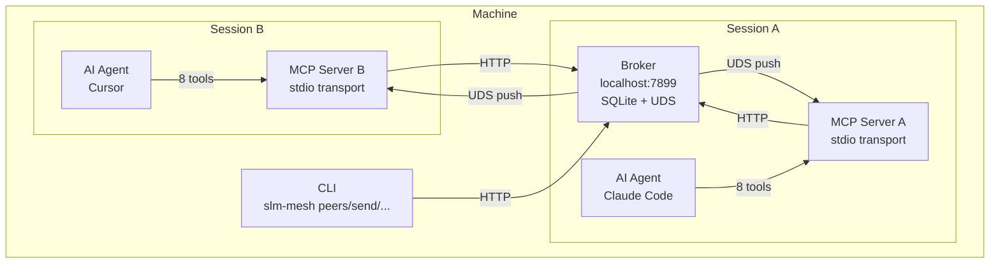
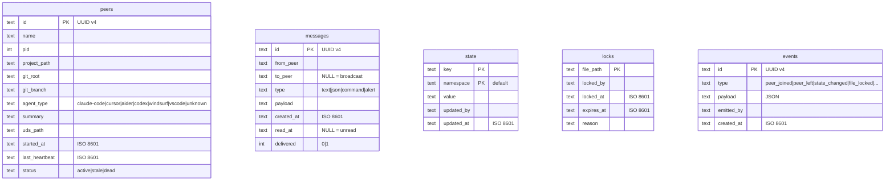

# Architecture

SLM Mesh is a broker-based peer-to-peer communication system for AI coding agents.

## System Overview



## Components

### Broker

One per machine. The central coordinator.

- **Auto-lifecycle** — Spawned by the first MCP server, stops after 60s with no peers
- **HTTP API** — 12 endpoints on localhost for MCP servers and CLI
- **SQLite** — WAL mode, 7 indexes, prepared statements, message/event TTL cleanup
- **Push Manager** — Maintains UDS connections to each MCP server for real-time delivery
- **Bearer Token Auth** — Random 32-byte token per session, required on all endpoints except `/health`

### MCP Server

One per AI agent session. The bridge between the agent and the mesh.

- **Stdio Transport** — Standard MCP protocol over stdin/stdout
- **8 Tools** — peer discovery, messaging, broadcast, shared state, file locking, event bus, health
- **Heartbeat** — Every 15 seconds to keep the peer alive
- **Peer Listener** — UDS server that receives push notifications from the broker
- **Agent Detection** — Identifies Claude Code, Cursor, Aider, Codex, Windsurf, VS Code via env vars and process tree

### CLI

Standalone binary for human interaction and scripting.

- **All Broker Operations** — status, peers, send, broadcast, state, lock, events, start, stop, clean
- **JSON Mode** — `--json` flag for programmatic consumption
- **Auth** — Reads bearer token from `~/.slm-mesh/broker.token`

### Adapter Layer

Pluggable backends for storage and memory integration.

- **BackendAdapter** — Interface for custom storage (SQLite is the default implementation)
- **MemoryBridge** — Interface for memory system integration (SuperLocalMemory bridge included)

## Data Model



## Communication Flow

### Message Delivery (Direct)

```
Agent A calls mesh_send(to: "peer-B", message: "auth refactored")
  → MCP Server A → HTTP POST /send → Broker
  → Broker inserts message into SQLite
  → Broker pushes via UDS to MCP Server B (<100ms)
  → MCP Server B delivers to Agent B as push notification
```

### Message Delivery (Broadcast)

```
Agent A calls mesh_send(to: "all", message: "deploy complete")
  → MCP Server A → HTTP POST /send → Broker
  → Broker wraps in transaction:
    → INSERT message for each active peer
    → Push via UDS to each peer
  → All peers receive simultaneously
```

### Peer Lifecycle

```
Session starts
  → MCP Server checks broker health (HTTP GET /health)
  → If not running: spawn broker as detached process, poll until ready
  → Register with broker (HTTP POST /register)
  → Broker assigns UUID peer ID, opens UDS channel
  → Start heartbeat (every 15s)

Session ends (clean)
  → MCP Server calls /unregister
  → Broker removes peer, releases locks, emits peer_left event

Session crashes (unclean)
  → Heartbeat stops
  → After 30s: broker marks peer as stale
  → After 60s: broker deletes peer, releases locks, emits peer_left event
```

## Data Persistence

- **Database**: `~/.slm-mesh/mesh.db` (SQLite, WAL mode)
- **PID file**: `~/.slm-mesh/broker.pid`
- **Port file**: `~/.slm-mesh/port`
- **Token file**: `~/.slm-mesh/broker.token` (0o600 permissions)
- **Log file**: `~/.slm-mesh/broker.log`
- **UDS sockets**: `~/.slm-mesh/peers/*.sock`

## Performance Characteristics

- **Message delivery**: <100ms via UDS push
- **SQLite writes**: Batched in transactions for broadcasts
- **Heartbeat overhead**: ~3.3 req/s with 50 peers (15s interval)
- **Prepared statements**: 29 pre-compiled SQL statements for zero parse overhead
- **Indexes**: 7 indexes on frequently queried columns
- **TTL cleanup**: Messages >24h and events >48h auto-pruned
- **Reconnect limits**: Max 10 reconnection attempts per dead peer
